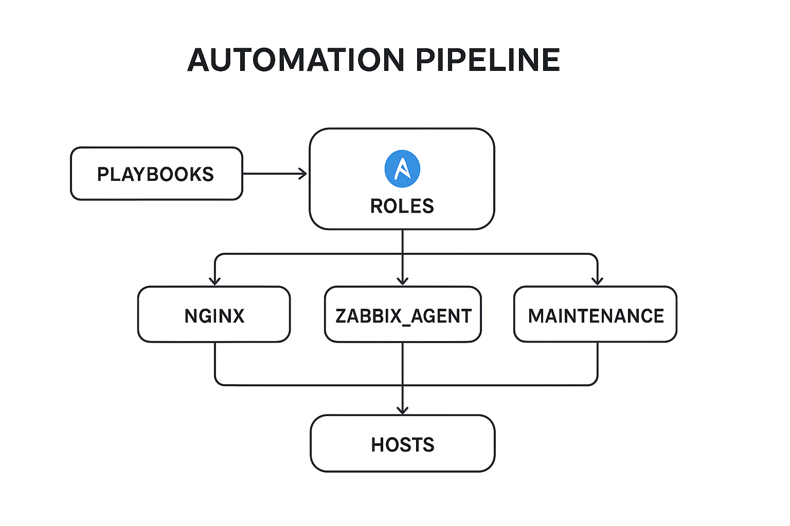

Automation Pipeline Challenge C3


Overview

This repository contains the solution for the Automation Pipeline Challenge C3, demonstrating automation using Ansible, CI/CD pipeline setup, and infrastructure configuration management. The project showcases modular and scalable automation practices for deploying and managing servers, applications, and monitoring agents.

Extended Description

The Automation Pipeline Challenge C3 demonstrates an end-to-end automation solution for managing infrastructure and applications using Ansible. This project simulates a real-world enterprise environment where servers, services, and monitoring agents must be deployed consistently and efficiently across multiple hosts.

Key highlights of this project:

Infrastructure as Code (IaC): Using Ansible roles and playbooks to standardize deployment and configuration.

Modular Architecture: Roles for NGINX, Zabbix agent, and maintenance tasks allow reusability and easier maintenance.

CI/CD Integration: Automated testing and deployment through GitLab CI/CD ensures reliable and repeatable processes.

Scalability: Inventory and variable management allow the playbooks to be applied to multiple environments or hosts without changes to core logic.

Documentation: Outputs and results are captured in docs/submission.pdf for easy review and validation.

This project highlights practical skills in automation, configuration management, CI/CD, and infrastructure reliability, making it a strong demonstration of DevOps and infrastructure engineering expertise.

## Automation Pipeline Diagram
<a href="docs/automation-pipeline.png">
  
</a>

Automated server and application setup using Ansible roles and playbooks.

Configuration management for NGINX, Zabbix agent, and maintenance tasks.

CI/CD pipeline integration with GitLab CI/CD.

Modular inventory and variable management for multiple environments.

Documentation of setup and outputs in docs/submission.pdf.

## Repository Structure
```text
automation-pipeline-challenge-c3/
├── ansible/
│   ├── inventories/
│   │   └── hosts.ini
│   ├── group_vars/
│   │   └── all.yml
│   ├── roles/
│   │   ├── nginx/
│   │   │   ├── tasks/main.yml
│   │   │   └── templates/
│   │   │       ├── nginx.conf.j2
│   │   │       └── site.conf.j2
│   │   ├── zabbix_agent/
│   │   │   ├── tasks/main.yml
│   │   │   └── templates/zabbix_agentd.conf.j2
│   │   └── maintenance/
│   │       └── tasks/main.yml
│   ├── playbooks/
│   │   ├── site.yml
│   │   ├── maintenance.yml
│   │   └── certs_create.yml
│   └── ansible.cfg
├── .gitlab-ci.yml
├── README.md
└── docs/
    └── submission.pdf


## How the Roles Work

| Role             | Purpose                               | Key Tasks |
|------------------|---------------------------------------|-----------|
| **nginx**        | Configure and deploy NGINX web server | Install NGINX, deploy `nginx.conf` & `site.conf` templates, start service |
| **zabbix_agent** | Deploy monitoring agent               | Install Zabbix agent, configure `zabbix_agentd.conf`, start service |
| **maintenance**  | Perform maintenance tasks             | Clean up logs, rotate files, run custom scripts |


## Prerequisites

Ansible >= 2.14

Python >= 3.11

Git installed locally

SSH access to target hosts

## Setup & Usage

Clone the repository:

git clone https://github.com/joycemwangi/automation-pipeline-challenge-c3.git
cd automation-pipeline-challenge-c3

## Run the main playbook (site.yml) to provision and configure servers:

ansible-playbook -i ansible/inventories/hosts.ini ansible/playbooks/site.yml

## Run maintenance tasks (optional):

ansible-playbook -i ansible/inventories/hosts.ini ansible/playbooks/maintenance.yml

## Generate or manage certificates:

ansible-playbook -i ansible/inventories/hosts.ini ansible/playbooks/certs_create.yml

##  CI/CD Integration

.gitlab-ci.yml defines the pipeline for automated testing and deployment of playbooks.

Pipeline stages include syntax checking, role linting, and deployment validation.

Contributing

Contributions are welcome. To contribute:

Fork the repository.

Create a feature branch (git checkout -b feature/your-feature).

Commit changes (git commit -m 'Add feature').

Push to the branch (git push origin feature/your-feature).

Open a pull request.

License

This project is licensed under the MIT License.
